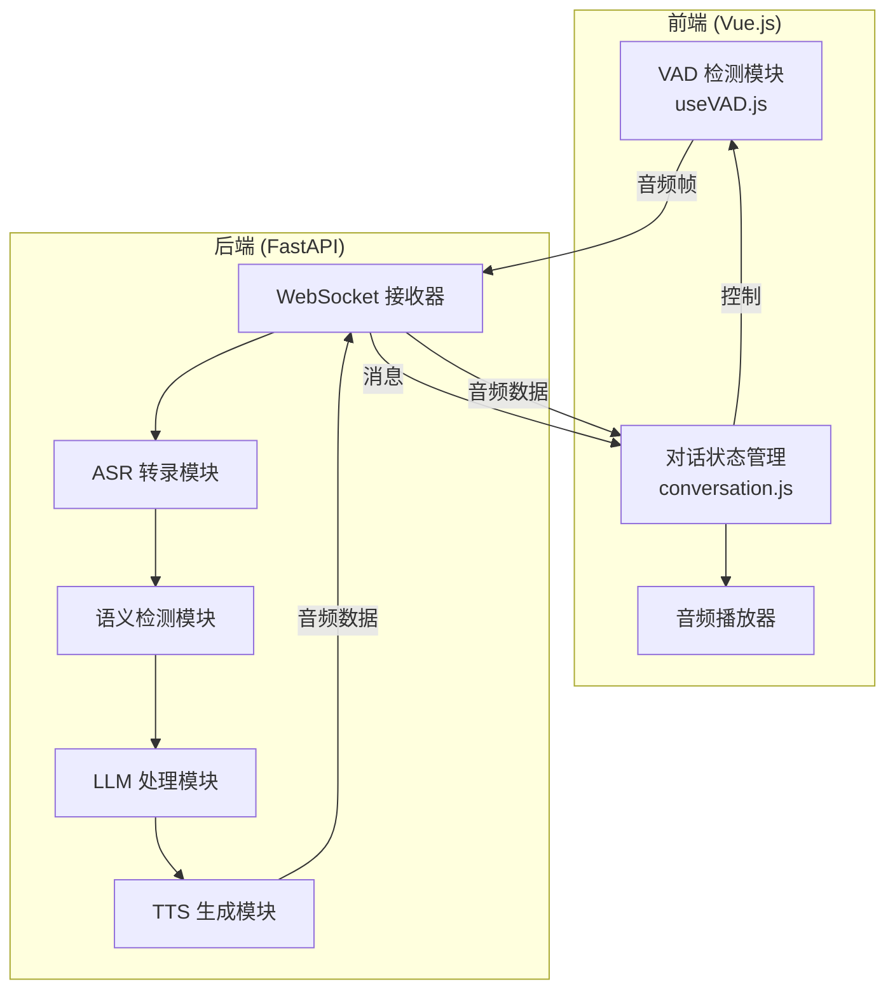
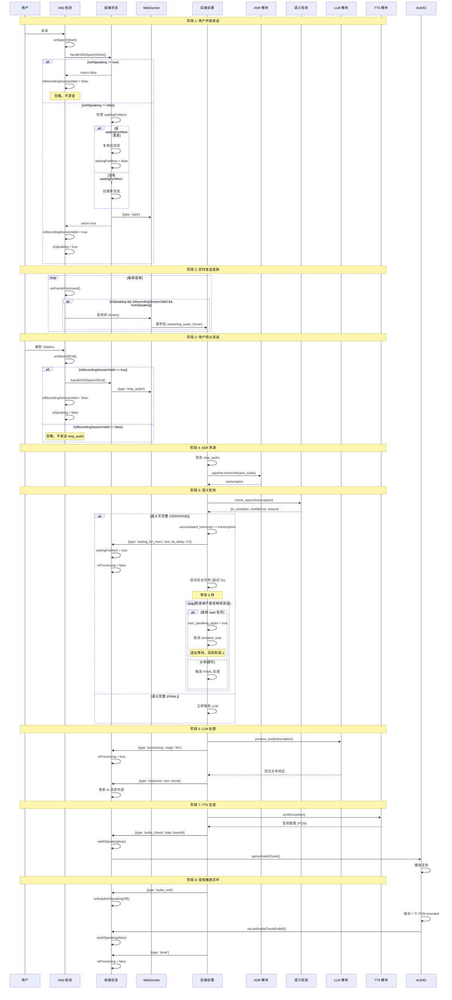
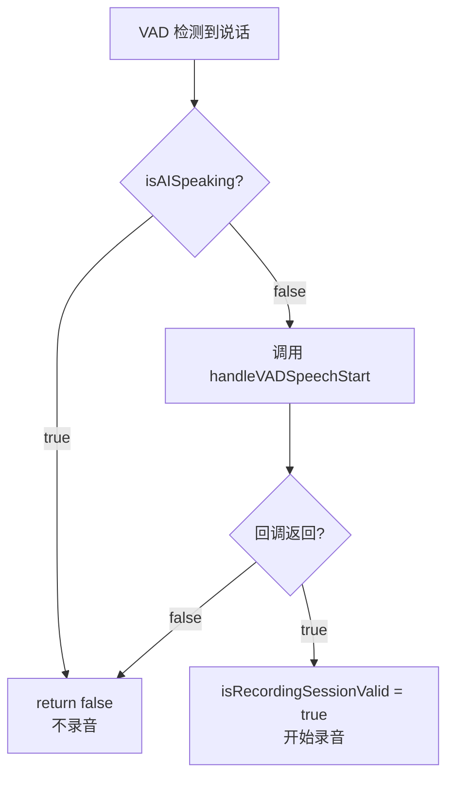
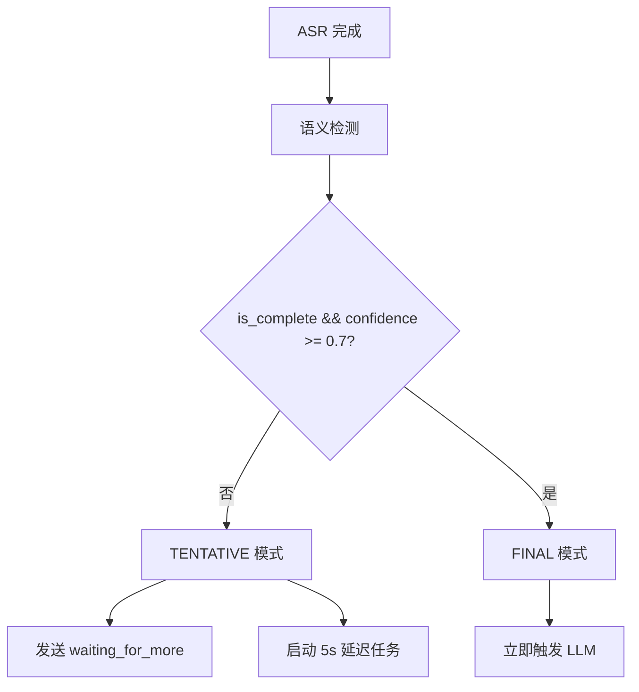
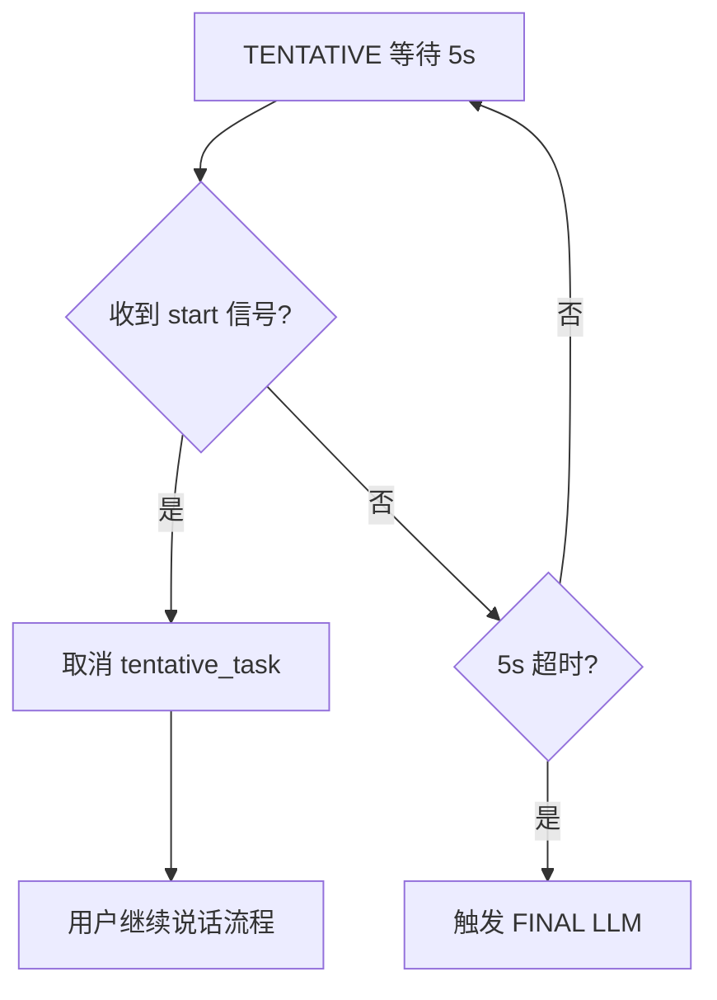
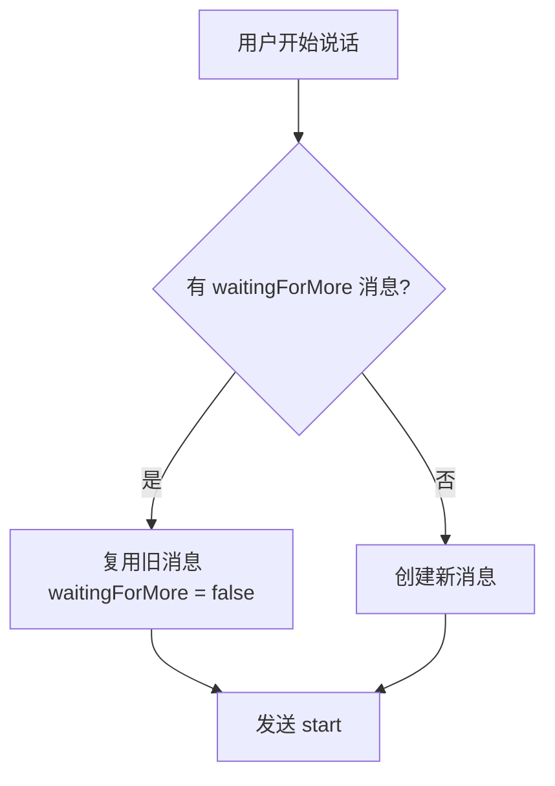
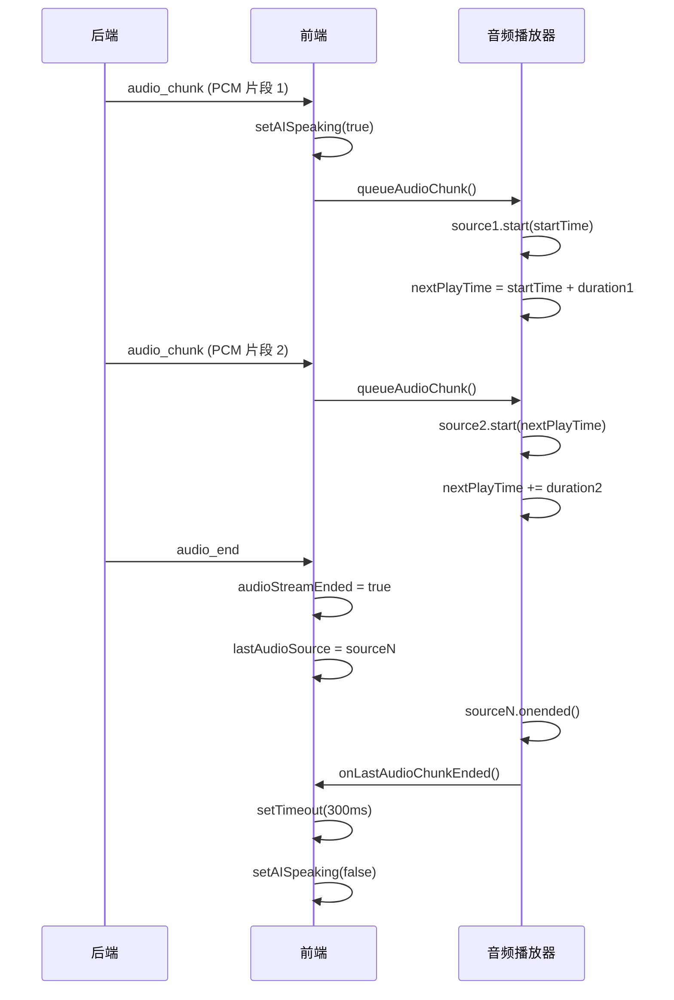
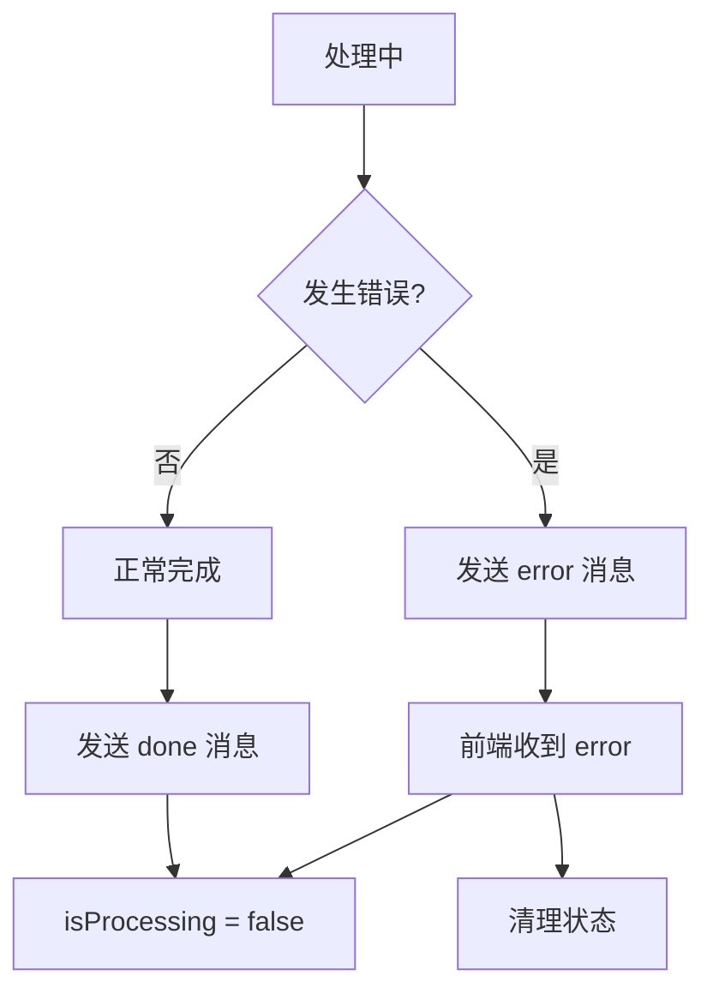
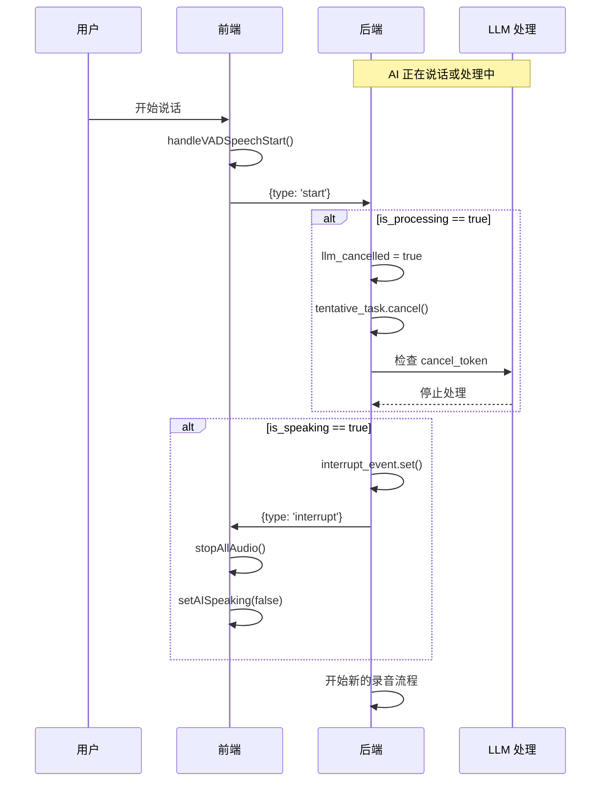

# LinguaCoach 完整流程图

## 系统架构概览

## 详细流程：用户说话 → AI 回复

## 关键状态变量

### 前端状态变量 (conversation.js)

| 变量 | 类型 | 作用 | 设置时机 |
|------|------|------|----------|
| `isAISpeaking` | `ref<boolean>` | AI 是否正在说话 | `audio_chunk` → true `onLastAudioChunkEnded()` → false |
| `isProcessing` | `ref<boolean>` | 后端是否正在处理 | `processing: llm` → true `done` / `error` → false `waiting_for_more` → false |
| `isSpeaking` | `ref<boolean>` | 用户是否正在说话 | VAD `onSpeechStart` → true VAD `onSpeechEnd` → false |
| `isRecording` | `ref<boolean>` | 是否正在录音 | `recording_started` → true `transcription` → false |
| `waitingForMore` | `message.waitingForMore` | 消息是否等待继续 | `waiting_for_more` → true 用户继续说话 → false |
| `isRecordingSessionValid` | `let boolean` | 当前录音会话是否有效 | `onSpeechStart` 回调返回 true → true `onSpeechEnd` → false |

### 后端状态变量 (pipeline_context)

| 变量 | 类型 | 作用 | 设置时机 |
|------|------|------|----------|
| `llm_status` | `str` | LLM 处理状态 | `TENTATIVE` / `FINAL` / `IDLE` |
| `is_processing` | `bool` | 是否正在处理 | LLM 开始 → true LLM 结束 → false |
| `accumulated_transcript` | `str` | 累积的转录文本 | TENTATIVE 模式累积 |
| `user_speaking_again` | `bool` | 用户是否继续说话 | `start` 消息 → true `stop_audio` → false |
| `tentative_task` | `asyncio.Task` | TENTATIVE 等待任务 | TENTATIVE 模式创建 `start` 消息取消 |

## 关键决策点

### 决策点 1: VAD 是否开始录音

### 决策点 2: 语义完整性判断

### 决策点 3: TENTATIVE 等待期间

### 决策点 4: 用户继续说话时的消息复用

## 音频播放时序

## 错误处理流程

## 打断机制

